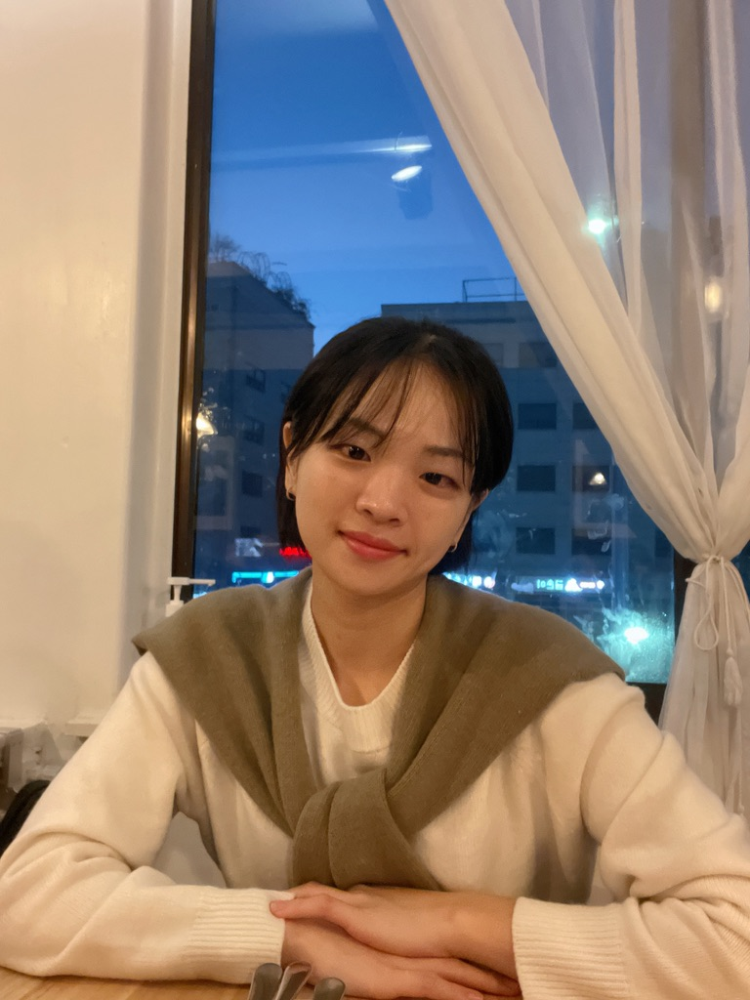
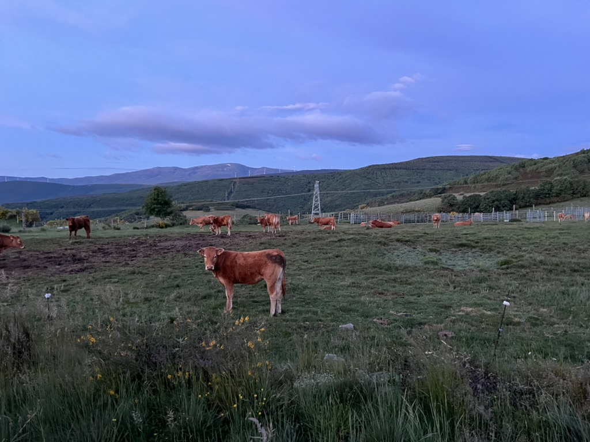

# About Me

I am a second year Master's student studying [Biostatistics](https://www.publichealth.columbia.edu/academics/departments/biostatistics) at Columbia University Mailman School of Public Health. 

I received a BS in Chemical Engineering from [Cornell University](https://www.engineering.cornell.edu) in 2017. After graduating, I started my career at [Samsung Biologics](https://samsungbiologics.com), a Biopharmaceutical Company focuses on active pharmaceutical ingredient (API) drug substance manufacturing in South Korea and worked for about 6.5 years. I mostly worked on validation in support of drug substance manufacturing and compliance to meet regulatory guideline requirements. 

#  More About Me

I love spicy food and wine. 

I enjoy hiking, trekking and running. I run half marathon every year and I finished my first Camino de Santiago French Way (St. James Way) in 2024 summer. This is a picture of a cow that I met during the walk. 

